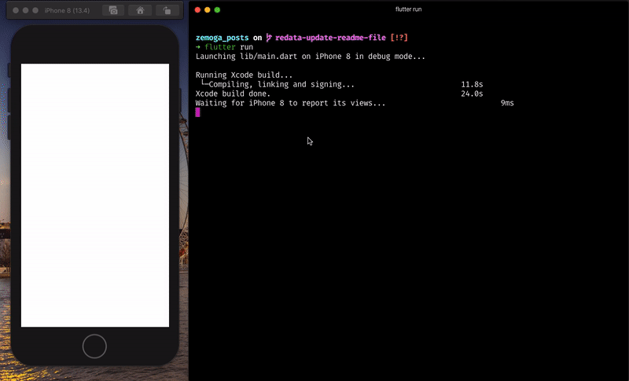

# zemoga_posts

An app that consumes [{JSON} Placeholder](https://jsonplaceholder.typicode.com/) API and It shows the posts with their own content like **description, user info and comments**. The user can save his favorites posts or delete them.


### Cloning

Clone the repo and use this flutter version `Flutter 1.22.5 • channel stable`

```sh
git clone https://github.com/data987/posts_app.git
```

### Getting Started

1. To install the packages you must run:

- `flutter pub get (terminal)`

  ###### If you have **Visual Studio Code**

- `cmd + s (Mac) / ctrl + s (Windows)` on `pubspec.yaml` file.

2. Connect a device or simulator and run:

- `flutter run (terminal)`

  ###### If you have **Visual Studio Code**

- `Invoke Run > Start Debugging or press F5. (Visual Studio Code)`.

### Architecture

This app use the **Bloc pattern** for the architecture, BLoC stands for **Business Logic Component**

Bloc needs to:

- be moved to one or several BLoC s,
- be removed as much as possible from the **Presentation Layer**. - In other words, UI components should only worry about the UI things and not about the business,
- rely on exclusive use of _Streams_ for both input **(Sink)** and output **(stream)**,
- remain platform independent,
- remain environment independent.
- A **streams** provides a way to receive a sequence of events


Using **Bloc** allows me to split the view from the business logic and update the streams that are related with some triggered event.


### Packages

##### 1. flutter_bloc - [package link](https://pub.dev/packages/flutter_bloc)

It's a [state management](https://bloclibrary.dev) that helps implement the [BLoC design pattern](https://www.didierboelens.com/2018/08/reactive-programming-streams-bloc/).

###### Pros:

- **Simple**: At a glance, it could be verbose and sometimes confused but It'is very easy to understand and use.

- **Powerful**: You could split the code into multiple widgets to make it deeply readable and I have the total app control (events, states and transitions).

- **Testable**: Everything can be easily tested.


##### 2. Equatable - [package link](https://pub.dev/packages/equatable)

It's an abstract class that helps to implement equality without needing to explicitly override == and **hashCode**.

###### Pros

- **flutter bloc** recommends to use it for [comparing objects](https://www.youtube.com/watch?v=s6xGDPWlWU4).

- It's very handy when you're going to test bloc props.

##### 3. Logger - [package link](https://pub.dev/packages/logger)

This package only prints beautiful logs, but It can be very useful for watching **Bloc logs**

###### Pros

- **flutter bloc** will show you the transitions between states and events in the console, so, it's very useful to see the logs like this:



##### 4. http - [package link](https://pub.dev/packages/http)

This package makes easy to consume HTTP resources

###### Pros

- The publisher is **dart.dev** so, It will probably always be updated to the latest flutter version.
- Easy to test.
- Easy to use.

##### 5. Mockito - [package link](https://pub.dev/packages/mockito)

It's a very simple way to create mocks in the test files.

###### Pros

- Easy to use with repositories and http request.
- Works great with **flutter bloc**

##### 6. Bloc test - [package link](https://pub.dev/packages/mockito)

This package works with **flutter bloc** and mockito

###### Pros

- Easy to test **flutter bloc** states
- It can create Bloc mocks
